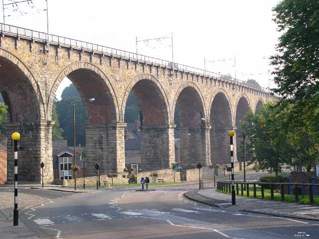
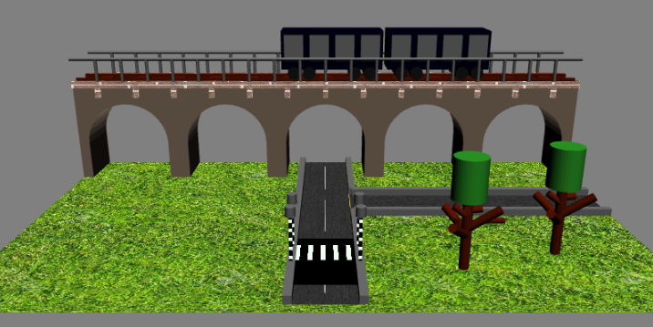

Assignment: 3D models (Computer Graphics)

A WebGL implementation of an environment based on a selected part of Durham City.

Image of inspiration | WebGL Implementation
:-------------:|:-------------:
  |  
